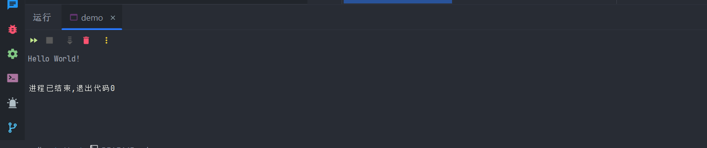

# He Virtual Machine

<hr/>

## 项目简介
&nbsp;&nbsp;&nbsp;&nbsp;本项目是一个简单的、图灵完备的脚本虚拟机，可以执行一个[特定的指令集](./design/He%20Virtual%20Machine%20design.md) .它有如下几个特性：

+ 支持常量池
+ 支持调用外部函数
+ 支持指令级别直接读写内存
+ 支持单步执行
+ 支持Stacktrace
+ 虚拟机运行于单独线程，但在销毁时会等待程序执行完毕

也有如下缺点：

- 未实现内建浮点数运算
- 未作任何优化
- 未实现字节码解析
- 未实现断点（简单，就不写了）

## Example

```cpp
#include <hevm.hh>


void he_puts(HeVM::VirtualMachine &vm){
    if(vm.stack.empty()){
        vm.crash("Function he_puts: invalid arguments, stack is empty!");
    }
    int64_t offset = vm.stack.top(); vm.stack.pop();
    puts((const char*)vm.constant_pool.data() + offset);
}

int main(){
    std::vector<HeVM::Instruction> program = {
        {HeVM::PUSH, 0, 0, 5},
        {HeVM::LOAD_VAL, 1, 0, 0},
        {HeVM::CALL_EXT, 1, 0, 0}
    };

    const char data[] = "puts\0Hello World!";
    std::vector<uint8_t> constants = { data, data + sizeof(data)};

    auto vm = HeVM::CreateVirtualMachine(program, constants);
    vm->bind_function("puts", he_puts);
    vm->run();
    return 0;
}
```

运行结果：



## 使用方法：
&nbsp;&nbsp;&nbsp;&nbsp;新建一个CMake项目（建议使用Clion或者 Visual Studio 2019以上版本）。

&nbsp;&nbsp;&nbsp;&nbsp;将本项目clone至HeVM目录，在项目的` CMakeLists.txt ` 文件中添加如下内容：
```cmake
add_subdirectory(HeVM)
target_link_libraries(你的target名 PUBLIC HeVM)
```

&nbsp;&nbsp;&nbsp;&nbsp;在你的C++源代码中加入如下内容:
```cpp
#include <hevm.hh>
```

&nbsp;&nbsp;&nbsp;&nbsp;在你需要创建虚拟机的地方使用如下代码：
```cpp
auto vm = HeVM::CreateVirtualMachine(program, constants); // 创建一个虚拟机实例
```

## API参考

### CreateVirtualMachine
```cpp
namespace HeVM{
    /**
     * @brief 创建一个虚拟机实例
     * @param programs 由指令四元组构成的程序
     * @param constant_pool 程序的常量池
     * @return 虚拟机实例
     */
    std::unique_ptr<VirtualMachine>
    CreateVirtualMachine(const std::vector<Instruction> &programs, const std::vector<uint8_t> &constant_pool);
};
```

### vm->run
```cpp
 /**
  * @brief 开始执行虚拟机
  */
 void VirtualMachine::run();
```
### vm->step
```cpp
 /**
  * @brief 单步执行虚拟机
  */
 void VirtualMachine::step();
```
### vm->pause
```cpp
/**
 * @brief 暂停虚拟机, 可用于主动销毁虚拟机时防止阻塞
 */
void VirtualMachine::pause();
```

### vm->crash
```cpp
/**
 * @brief 使虚拟机崩溃
 * @param reason 崩溃说明
 */
void crash(const std::string &reason);
```

### vm->bind_function
```cpp
/*
 * 绑定函数的原型
 */
using ExternalFunction = std::function< void(VirtualMachine& vm)>;

/**
 * @brief 绑定外部函数，供CALL_EXT指令调用
 * @param name 函数名称
 * @param function 绑定到的函数
 */
void VirtualMachine::bind_function(const std::string& name, ExternalFunction function);
```
Example:
```cpp
/**
 * @param vm 虚拟机对象，如需要传参，请从vm.stack中获取
 */
void fun(HeVM::VirtualMachine& vm){
    
}
```


